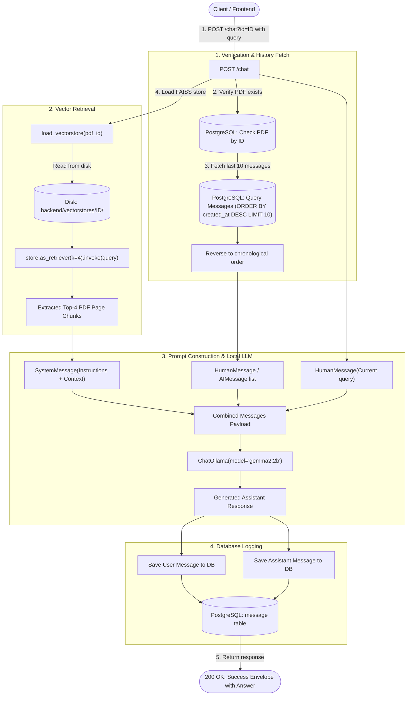

# DocuChat — Local RAG PDF Chatbot

> **Note**: This is an educational and learning project built to explore and demonstrate end-to-end **Retrieval-Augmented Generation (RAG)** using local models, relational persistence, vector databases, and modern full-stack web technologies.

---

## Table of Contents

- [Overview](#overview)
  - [Key Architecture & Features](#key-architecture--features)
- [Architecture & Pipeline Diagrams](#architecture--pipeline-diagrams)
  - [1. Upload & Ingestion Pipeline (POST /upload)](#1-upload--ingestion-pipeline-post-upload)
  - [2. Query & Chat Pipeline (POST /chat)](#2-query--chat-pipeline-post-chat)
  - [Disk Storage Paths & Directory Layout](#disk-storage-paths--directory-layout)
- [Tech Stack](#tech-stack)
- [Prerequisites](#prerequisites)
- [Step-by-Step Installation & Setup](#step-by-step-installation--setup)
  - [1. Database Setup (PostgreSQL)](#1-database-setup-postgresql)
  - [2. Ollama LLM Setup](#2-ollama-llm-setup)
  - [3. Backend Setup](#3-backend-setup)
  - [4. Frontend Setup](#4-frontend-setup)
- [Project Structure](#project-structure)
- [API Endpoints](#api-endpoints)
- [Standard Response Format](#standard-response-format)
- [License](#license)

---

## Overview

**DocuChat** allows users to upload PDF documents and engage in context-aware conversations with them. It indexes documents locally into dedicated FAISS vector stores, stores conversation histories and metadata in PostgreSQL, and generates responses completely offline using local embeddings and Ollama.

### Key Architecture & Features

- **Zero-Cloud / 100% Local Inference**:
  - Embeddings: `sentence-transformers/all-MiniLM-L6-v2`
  - LLM: `gemma2:2b` via [Ollama](https://ollama.com)
- **RAG Pipeline (LangChain + FAISS)**:
  - **Upload Time (Ingestion)**: Extract pages via `PyPDFLoader` -> Chunk with `RecursiveCharacterTextSplitter` (1000 char size, 200 overlap) -> Embed and persist vector index per PDF ID into `vectorstores/<id>/`.
  - **Query Time (Retrieval)**: Load persisted vector store -> Fetch top-4 relevant chunks -> Inject conversation history (last 10 messages) + document context into system prompt -> Generate response.
- **Relational Database (SQLModel + PostgreSQL)**:
  - Stores `PDF` records (id, filename, file path, timestamp).
  - Stores `Message` chat history (`role: user | assistant`, content, timestamps, foreign key relationship).
- **Modern 2-Column UI (React + TypeScript + Vite)**:
  - Left panel: list of uploaded PDF documents with click-to-chat routing.
  - Right panel: drag-and-drop PDF uploader with progress state.
  - Chat interface: conversation history, optimistic rendering, typing animation, and back navigation.

---

## Architecture & Pipeline Diagrams

### 1. Upload & Ingestion Pipeline (`POST /upload`)

The ingestion pipeline executes **once per uploaded PDF**. Instead of re-embedding the document on every query, the PDF is processed and stored on disk indexed by its unique database ID.

```mermaid
flowchart TD
    Client([Client / Frontend]) -->|1. Upload PDF multipart form| UploadRoute["POST /upload"]
    
    subgraph DatabasePhase ["1. Two-Phase Database Insert & ID Generation"]
        UploadRoute -->|2. Store metadata without file path to obtain auto-generated ID| SaveDB["save_pdf_to_db(pdf, session)"]
        SaveDB -->|Generates primary key ID| PDFRecord[("PostgreSQL: PDF (id, file_name, file_path='')")]
        PDFRecord -->|3. Construct file path using generated ID: uploads/ID.pdf| GetPath["get_pdf_path(pdf_id)"]
        GetPath -->|4. Update database record with generated file_path| UpdateDB["update_pdf_file_path(pdf_record, file_path, session)"]
        UpdateDB --> UpdatedDB[("PostgreSQL: Updated PDF with file_path")]
    end
    
    subgraph DiskPhase ["2. File System Persistence"]
        UpdatedDB -->|5. Write raw bytes to disk using new ID-based path| WriteDisk["save_pdf_to_disk(file_path, pdf)"]
        WriteDisk --> RawFile[("Disk: backend/uploads/ID.pdf")]
    end
    
    subgraph IngestionPhase ["3. LangChain Ingestion & Vector Indexing"]
        RawFile -->|6. Load document from disk path| PyPDF["PyPDFLoader(file_path)"]
        PyPDF -->|7. Split into chunks| Splitter["RecursiveCharacterTextSplitter(1000, 200)"]
        Splitter -->|8. Generate embeddings| Embeddings["sentence-transformers/all-MiniLM-L6-v2"]
        Embeddings -->|9. Build FAISS index| VectorStore["FAISS.from_documents(chunks, embeddings)"]
        VectorStore -->|10. Persist vector index to disk| SaveFAISS["save_local('vectorstores/ID')"]
        SaveFAISS --> FAISSFiles[("Disk: backend/vectorstores/ID/<br/>index.faiss & index.pkl")]
    end
    
    FAISSFiles -->|11. Return JSON response| Response(["200 OK: Success Envelope with ID & Filename"])
```



---

### 2. Query & Chat Pipeline (`POST /chat?id=<pdf_id>`)

When a user asks a question, the query pipeline loads the pre-built FAISS index for that PDF, retrieves the most relevant chunks, appends conversation history from PostgreSQL, and streams the prompt to the local LLM.



---

### Disk Storage Paths & Directory Layout

All user-uploaded files and their corresponding FAISS vector stores are isolated on disk by the unique database `pdf_id`:

```
backend/
├── uploads/
│   ├── 1.pdf                     # Raw PDF file stored by database ID (pdf_id = 1)
│   ├── 2.pdf                     # Raw PDF file stored by database ID (pdf_id = 2)
│   └── .gitkeep
└── vectorstores/
    ├── 1/                        # Isolated FAISS vector store for PDF ID = 1
    │   ├── index.faiss           # Serialized FAISS vector embeddings index
    │   └── index.pkl             # Document metadata and chunk store
    └── 2/                        # Isolated FAISS vector store for PDF ID = 2
        ├── index.faiss
        └── index.pkl
```

- **Original Filename**: Preserved in the PostgreSQL `pdf.file_name` column for user display.
- **Disk File Path**: Stored in the PostgreSQL `pdf.file_path` column pointing directly to `uploads/{pdf_id}.pdf`.
- **Vector Index Path**: Resolved dynamically via `vectorstores/{pdf_id}/`.

---

## Tech Stack

| Layer | Technology |
|---|---|
| **Backend Framework** | [FastAPI](https://fastapi.tiangolo.com/) + [uvicorn](https://www.uvicorn.org/) |
| **ORM / Database** | [SQLModel](https://sqlmodel.tiangolo.com/) + [PostgreSQL](https://www.postgresql.org/) (`psycopg2`) |
| **Package / Environment Manager** | [uv](https://docs.astral.sh/uv/) |
| **RAG & Vector Search** | [LangChain](https://www.langchain.com/) + [FAISS](https://github.com/facebookresearch/faiss) (`faiss-cpu`) |
| **Embeddings** | [HuggingFace / Sentence-Transformers](https://huggingface.co/sentence-transformers/all-MiniLM-L6-v2) |
| **Local LLM** | [Ollama](https://ollama.com/) running `gemma2:2b` |
| **Frontend** | [React 19](https://react.dev/) + [TypeScript](https://www.typescriptlang.org/) + [Vite](https://vitejs.dev/) + [Lucide Icons](https://lucide.dev/) |

---

## Prerequisites

Before running the project, ensure you have the following installed on your machine:

1. **Python** (>= 3.11) & [`uv`](https://docs.astral.sh/uv/getting-started/installation/):
   ```bash
   # Install uv (macOS / Linux)
   curl -LsSf https://astral.sh/uv/install.sh | sh
   ```
2. **Node.js** (>= 18) & `npm`:
   ```bash
   node --version
   npm --version
   ```
3. **PostgreSQL** (running locally on port `5432`):
   ```bash
   # macOS (Homebrew)
   brew install postgresql@16
   brew services start postgresql@16
   ```
4. **Ollama**:
   - Download and install from [ollama.com](https://ollama.com/).

---

## Step-by-Step Installation & Setup

### 1. Database Setup (PostgreSQL)

Create the PostgreSQL database named `pdf_chatbot`:

```bash
# Create database via CLI
createdb pdf_chatbot

# Or using psql
psql -c "CREATE DATABASE pdf_chatbot;"
```

---

### 2. Ollama LLM Setup

Pull the lightweight `gemma2:2b` model and ensure the daemon is running:

```bash
# Pull the model (~1.6GB)
ollama pull gemma2:2b

# Start the Ollama server (keep running or verify service status)
ollama serve
```

---

### 3. Backend Setup

Navigate to the `backend` directory and configure the environment:

```bash
cd backend

# Create your .env file from the template
cp .env.example .env
```

Edit `.env` to match your local PostgreSQL credentials:
```env
DATABASE_URL=postgresql+psycopg2://<your-username>:<your-password>@localhost:5432/pdf_chatbot
```

Install backend dependencies and run the server:

```bash
# Run server with auto-reload (tables will be created automatically on first run)
uv run uvicorn main:app --reload
```

The API will be live at `http://127.0.0.1:8000`.

---

### 4. Frontend Setup

In a separate terminal window, navigate to the `frontend` directory:

```bash
cd frontend

# Install dependencies
npm install

# Start development server
npm run dev
```

The application will be accessible at **`http://localhost:5173`**.

---

## Project Structure

```
pdf-chatbot/
├── README.md               # Project documentation & architecture diagrams
├── backend/
│   ├── main.py             # FastAPI routes & exception handling
│   ├── models.py           # SQLModel database schemas (PDF, Message)
│   ├── database.py         # DB connection & session dependency
│   ├── rag.py              # Ingestion, embeddings, FAISS & ChatOllama
│   ├── utils.py            # File helpers, paths & response envelopes
│   ├── pyproject.toml      # Backend dependencies
│   ├── .env.example        # Environment variables template
│   ├── uploads/            # Raw PDF files (named by PDF ID: uploads/<id>.pdf)
│   └── vectorstores/       # Persisted FAISS vector indexes (vectorstores/<id>/)
└── frontend/
    ├── src/
    │   ├── App.tsx         # Dashboard (PDF list + Upload) & Chat views
    │   ├── App.css         # Dark theme & component styling
    │   └── main.tsx        # React entrypoint
    ├── package.json        # Frontend dependencies
    └── vite.config.ts      # Vite configuration
```

---

## API Endpoints

| Method | Endpoint | Description |
|---|---|---|
| `GET` | `/health` | Health check endpoint |
| `GET` | `/pdfs` | List all uploaded PDFs ordered by newest first |
| `POST` | `/upload` | Upload & index a PDF document (`multipart/form-data`) |
| `GET` | `/chat/{id}` | Fetch previous messages for a PDF |
| `POST` | `/chat?id={id}` | Query the PDF with conversation history |

---

## Standard Response Format

All API responses follow a uniform envelope format:

```json
{
  "success": true,
  "message": "Operation description",
  "data": { ... }
}
```

---

## License

This project is open-source and intended for educational and experimentation purposes.
